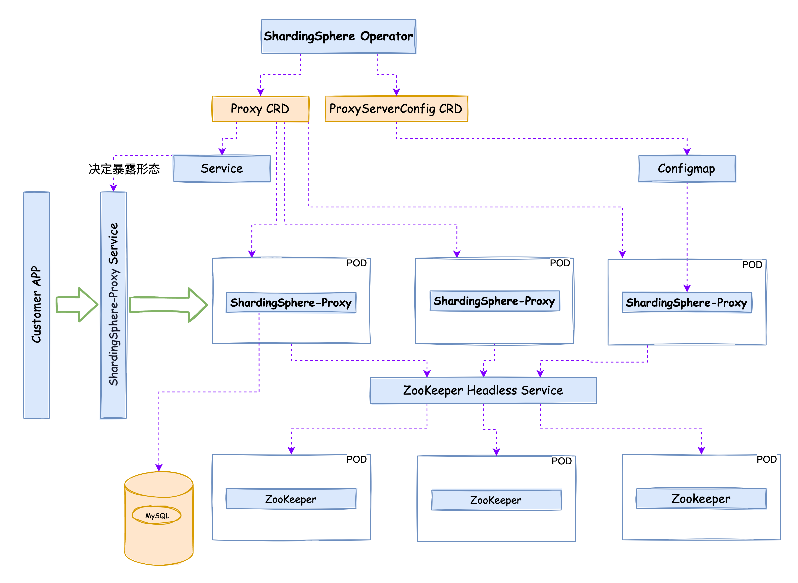

# shardingsphere-on-cloud

This repository collects scripts, tools, manifests and documentations, provides home for [Apache ShardingSphere](https://shardingsphere.apache.org/) on cloud solutions.

Solutions currently included in this project:

* The [ShardingSphere-Operator](https://github.com/SphereEx/shardingsphere-on-cloud/tree/main/shardingsphere-operator)

The ShardingSphere operator uses predefined CustomResourceDefinitions for describing a Deployment for Apache ShardingSphere on Kubernetes. // ADD 

## ShardingSphere Operator
### Prerequisites

With the help of ShardingSphere-Operator you could create a ShardingSphere-Proxy cluster including the ZooKeeper cluster in minutes.

For installation of SharingSphere-Operator, you will need a Kubernetes cluster, no matter it is a managed Kubernetes service like AWS EKS or self-hosted Kubernetes, or just a mini-kube, you can easily install ShardingSphere-Operator with respective [ShardingSphere Operator Helm Charts](https://github.com/SphereEx/shardingsphere-on-cloud/tree/main/charts/shardingsphere-cluster), and apply the manifests in [ShardingSphere Cluster Helm Charts](https://github.com/SphereEx/shardingsphere-on-cloud/tree/main/charts/shardingsphere-cluster) describing the expected Apache ShardingSphere deployment. **Kubernetes 1.18+ is recommended**. 

### Internal Architecture

### Current Status

Minimum Viable Product

### Quick Start 

[quick start](./doc/deploy.md)

### Features

* Supports the use of proxy to configure and describe the shardingsphere-proxy cluster. For detailed configuration, see the deployment documentation
* Support native shardingsphere proxy server.yaml configuration. For specific support items, please refer to the documentation
* Support automatic creation of HPA based on cpu metrics
* Support automatic download of MySQL driver

### Installation
#### Helm
* ShardingSphere-Operator chart
    * Support deploy shardingsphere operator
* ShardingSphere-Cluster chart
    * Support deploy shardingsphere proxy cluster
    * Support deploy Zookeeper by bitnami
    * Support automatic configuration of the address of the governance center
    * Use github pages  to host repositories and support helm repo add to add repositories 

### Development Prerequisites

To build ShardingSphere Operator from scratch you will need to install the following tools:

* Git
* [Golang 1.17](https://golang.org/dl/)
* make
* Kubernetes 1.20+ 
* Kubebuilder 3.4.1+

## Contributing

To contribute to this project, refer to [Contributing](CONTRIBUTING.md).

## Join the discussion

If you have any questions or feedback regarding this project, join the [Apache ShardingSphere Slack](https://join.slack.com/t/apacheshardingsphere/shared_invite/zt-sbdde7ie-SjDqo9~I4rYcR18bq0SYTg).

For Wechat users, follow this .

## License

Apache License 2.0, see [LICENSE](https://github.com/SphereEx/shardingsphere-on-cloud/blob/main/LICENSE).