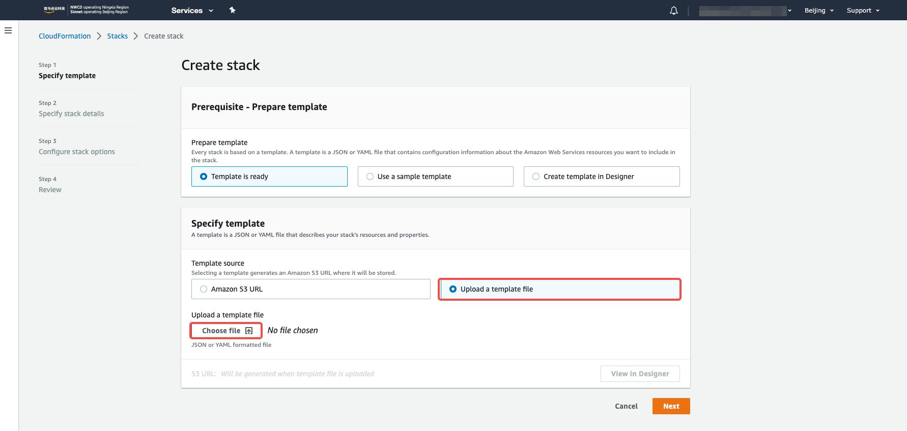
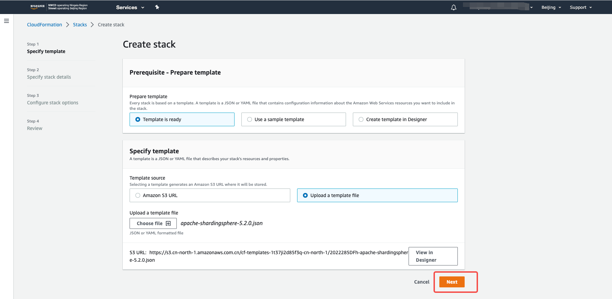
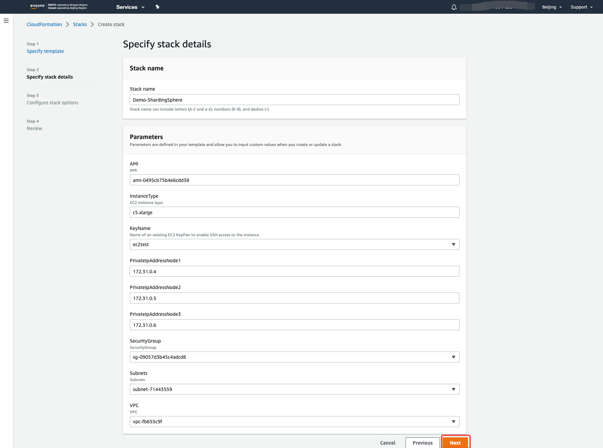
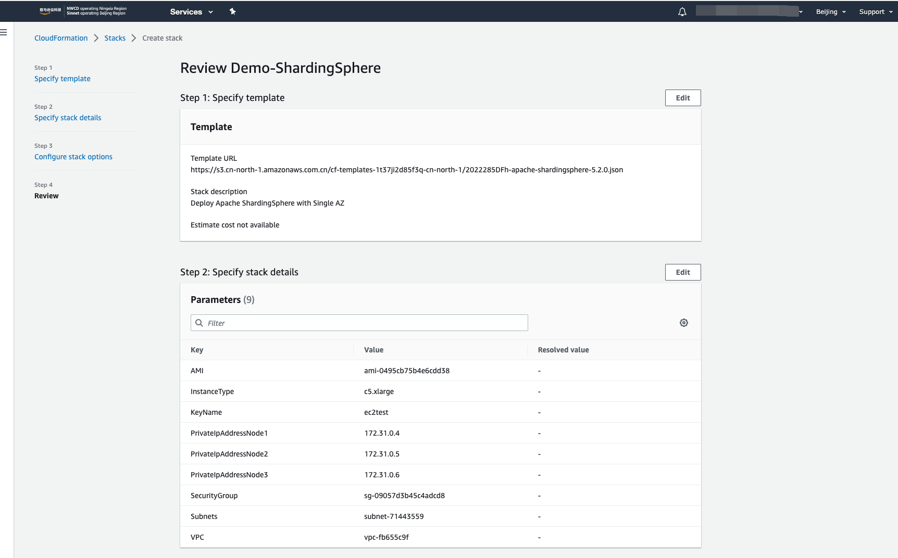
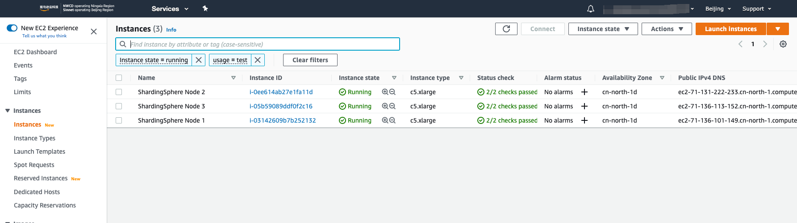
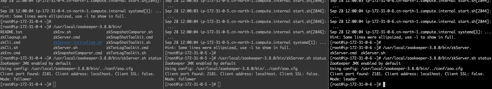
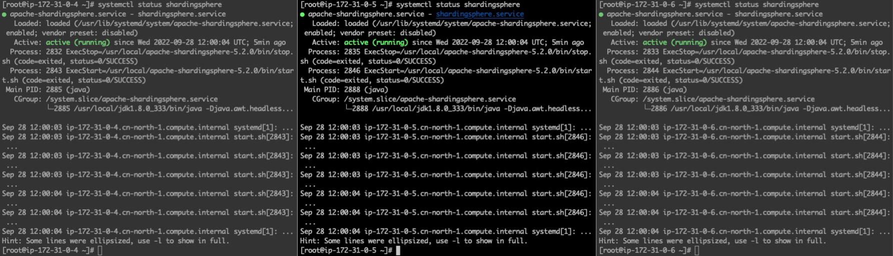
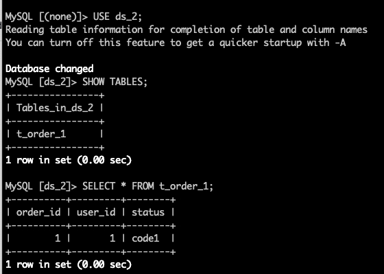

# Startup ShardingSphere Proxy with CloudFormation

As we know that AWS CloudFormation is an easy to use tool for setup any environments and infrastructure in an Infrasture as Code way. Since it is really helpful, we proposed this CloudFormation Stack template to help people who want to try Apache ShardingSphere on AWS in minutes.

## Prerequesites 

Before we start, there are several items on the checklist. 

- [ ] Region ap-north-1, currently the AMI contains Apache ShardingSphere Proxy and related components is only available in ap-north-1
- [ ] An VPC where we place Apache ShardingSphere Proxy 
- [ ] A designed CIDR and Subnets of this VPC
- [ ] A SecurityGroup which allows application(e.g. 3307) and control traffic(e.g. 22)
- [ ] A keypair for these instances 
- [ ] Any tags for this stack 

## Setup a ShardingSphere Proxy cluster

### 1. Create a CloudFormation stack with new resources  

As below shows

### 2. Upload the template file in this repo

Upload local file as `cloudformation/apache-shardingsphere-5.2.0.json` to CloudFormation, then click `Next`.

### 3. Specify CloudFormation stack details

Fill the blanks in this pages, the required informations are prepared in 

### 4. Configure Stack Options

Add some tags to mark this stack. This is always useful for cost analysis.

### 5. Review and ensure the configuration

Review the configuration and submit it if everything is expteced.

### 6. Check the EC2 instances

After several minutes, the EC2 instances are spinned up.

### 7. Check ShardingSphere Proxy and Zookeeper status 

Use `systemctl status shardingsphere` and `./bin/zkServer.sh status` to check the status of both components

### 8. Test with a simple sharding Demo

Try to create a database `sharding_db` and add two seperate database instances `resources`. Then create sharded table `t_order` and insert two rows. Check this result like below:

