# Solutions for StackGres

## Background

StackGres is a Kubernetes operator for PostgreSQL. Apache ShardingSphere is a distributed SQL transaction & query engine for data sharding, scaling, encryption, and most importnantly could be built on any databases. This means there could be a intergation solution which will build a distributed PostgreSQL cluster exploit StackGres and Apache ShardingSphere. 

From StackGres's perspective, there are two kinds of solution as below:

<table>
        <tr>
                <th>       </th>
                <th> Basic </th>
                <th> Advanced </th>
        </tr>
        <tr>
                <td rowspan="4"> Features </td>
                <td> * Half-Managed </td>
		<td> * Fully-Managed </td>
        </tr>
        <tr>
                <td> * Dual-Operators </td>
		<td> * Only StackGres Operator  </td>
        </tr>
        <tr>
                <td> * Exploit existed ShardingSphere Operator's functionalities </td>
		<td> * Every required functionalities are implemented in StackGres Operator </td>
        </tr>
	<tr>
		<td> User Experience </td>
		<td> * Users could perceive two operators </td>
		<td> * Users experience intergrity </td>
	</tr>
	<tr>
		<td> Developer Experience </td>
		<td> * Decoupled development, and seperated maintainence. Built with Go & Java </td>
		<td> * Coupled development, Java stack </td>
	</tr>
	<tr>
		<td rowspan="4">  Potential tasks </td>
		<td> * Helm Charts of StackGres add an option which decicde the installation of ShardingSphere Operator, and dependency of ShardingSphere Charts </td>
		<td> * SGShardedCluster's property `type` add another available value `ShardingSphere`, and a new property `ShardingSphereProfile` refering the name of new CR ShardingSphereProfile. </td>
	</tr>
	<tr>
                <td> * SGShardedCluster's property `type` add another available value `ShardingSphere` and other properties that could be rendered into a ComputeNode CR </td>
		<td> * A new CRD called ShardingSphereProfile which defines the required workload definitions for ShardingSphere Proxy such as Deployment, Service and ConfigMap. </td>
	</tr>
	<tr>
		<td></td>
		<td> * A new CRD called ShardingSphereDistSQLJob which defines serveral kinds of DistSQL job like `CREATE DATABASE`, `REGISTER STORAGE UNIT` and `CREATE SHARDING TABLE RULE`. </td>
	</tr>
</table>


Here is a architecture illustration for this sharded PostgreSQL cluster with Apache ShardingSphere and StackGres:

```shell

+--------------------------+        +-----------------------------+
| ShardingSphere Operator  | -----> | Apache ShardingSphere Proxy | 
+--------------------------+        +-----------------------------+
                                                   |
						   V
				    +-----------------------------+
+--------------------------+        |    SGCluster Cluster-1      | 
|   StackGres Operator     | -----> +-----------------------------+
+--------------------------+        |    SGCluster Cluster-2      | 
                                    +-----------------------------+
```


## Demo

1. Create a Kubernetes namespace for demo

```shell
kubectl create namespace sg-demo
```

2. Install StackGres with Helm Charts 

```shell
# Add StachGres Helm repo
helm repo add stackgres-charts https://stackgres.io/downloads/stackgres-k8s/stackgres/helm/

# Install StachGres operator
helm install --namespace sg-demo stackgres-operator stackgres-charts/stackgres-operator
```

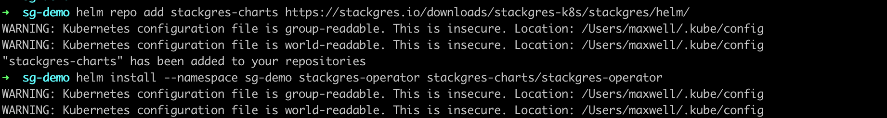
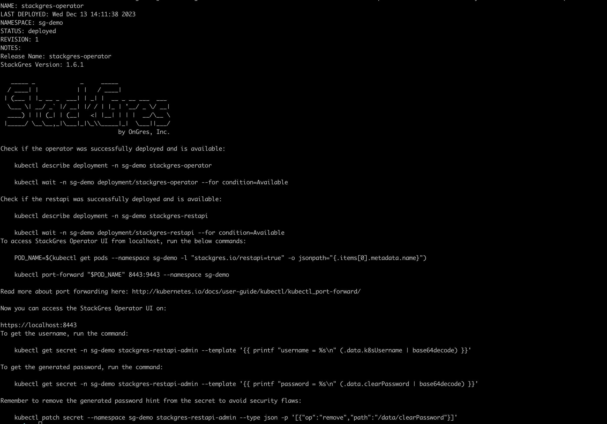
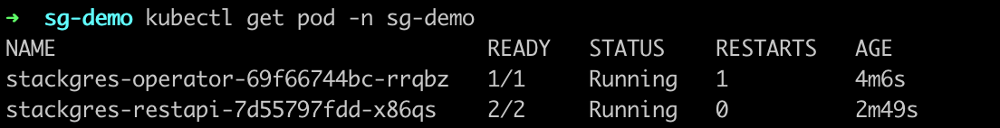

3. Create two minimum SGCluster

```shell
cat << 'EOF' | kubectl create -f -
apiVersion: stackgres.io/v1
kind: SGCluster
metadata:
  name: cluster-1
  namespace: sg-demo
spec:
  instances: 1
  postgres:
    version: 'latest'
  pods:
    persistentVolume: 
      size: '5Gi'
EOF

cat << 'EOF' | kubectl create -f -
apiVersion: stackgres.io/v1
kind: SGCluster
metadata:
  name: cluster-2
  namespace: sg-demo
spec:
  instances: 1
  postgres:
    version: 'latest'
  pods:
    persistentVolume: 
      size: '5Gi'
EOF
```
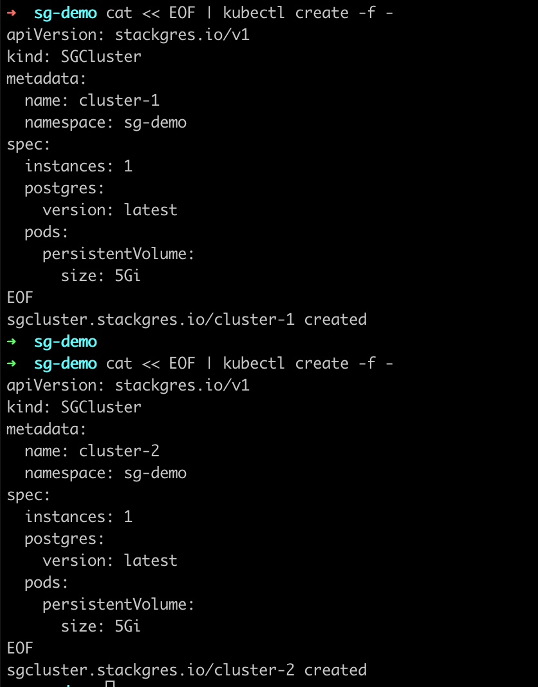


4. Retrieve two SGCluster PostgreSQL username and password by decoding the secrets

```shell
# Retrieve username and password of cluster-1, which is postgres / 5bc0-07f8-40b3-b81
kubectl get secret cluster-1 -n sg-demo -o jsonpath="{.data.superuser-username}" | base64 -d
kubectl get secret cluster-1 -n sg-demo -o jsonpath="{.data.superuser-password}" | base64 -d

# Retrieve username and password of cluster-2, which is postgres / 700e-33b3-4edf-bde
kubectl get secret cluster-2 -n sg-demo -o jsonpath="{.data.superuser-username}" | base64 -d
kubectl get secret cluster-2 -n sg-demo -o jsonpath="{.data.superuser-password}" | base64 -d
```

5. Install the ShardingSphere Operator 

```
# Add Apache ShardingSphere Helm repo
helm repo add shardingsphere https://apache.github.io/shardingsphere-on-cloud

# Install ShardingSphere operator 
helm install shardingsphere-operator shardingsphere/apache-shardingsphere-operator-charts -n sg-demo --set zookeeper.persistence.enabled=false --set operator.featureGates.computeNode=true --set proxyCluster.enabled=false
```
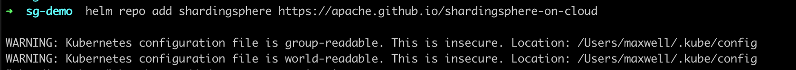
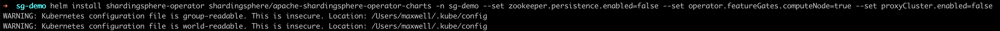
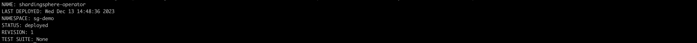
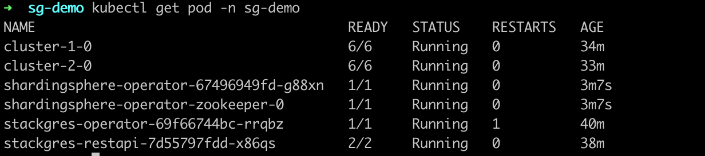

6. Create a ComputeNode

```shell
cat << EOF | kubectl create -f -
apiVersion: shardingsphere.apache.org/v1alpha1
kind: ComputeNode
metadata:
  annotations:
    shardingsphere.apache.org/java-agent-enabled: "true"
    prometheus.io/path: "/metrics"
    prometheus.io/scrape: "true"
    prometheus.io/port: "9090"
  labels:
    app: shardingsphere-proxy
  name: shardingsphere-proxy
  namespace: sg-demo
spec:
  serverVersion: 5.4.1
  replicas: 1
  selector:
    matchLabels:
      app: shardingsphere-proxy
  portBindings:
  - name: server
    containerPort: 5432
    servicePort: 5432
    protocol: TCP
  serviceType: ClusterIP
  bootstrap:
    serverConfig:
      authority:
        privilege:
          type: ALL_PERMITTED
        users:
        - user: root@%
          password: root
      mode:
        type: Cluster
        repository:
          type: ZooKeeper
          props:
            timeToLiveSeconds: "600"
            server-lists: shardingsphere-operator-zookeeper.sg-demo:2181
            retryIntervalMilliseconds: "500"
            operationTimeoutMilliseconds: "5000"
            namespace: governance_ds
            maxRetries: "3"
      props:
        proxy-frontend-database-protocol-type: PostgreSQL
        proxy-default-port: "5432"
    agentConfig:
      plugins:
        logging:
          file:
            props:
              level: "INFO"
        metrics:
          prometheus:
            host: "0.0.0.0"
            port: 9090
            props:
              jvm-information-collector-enabled: "true"
EOF
```
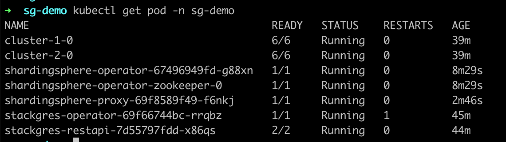

7. Connect to ShardingSphere Proxy and register a cluster   

```shell
# Using kubectl port-forward to expose ShardingSphere Proxy for localhost connection
 kubectl port-forward svc/shardingsphere-proxy  -n sg-demo 5432:5432

# Using psql to connect to ShardingSphere Proxy
psql -h 127.0.0.1 -p 5432 postgres root

# Create a logical database named sharding_db;
postgres=> CREATE DATABASE sharding_db;

# Change to this database
postgres=> \c sharding_db;

# Register storage units
sharding_db=> REGISTER STORAGE UNIT ds_0 (HOST="cluster-1.sg-demo", PORT=5432, DB="postgres", USER="postgres", PASSWORD="5bc0-07f8-40b3-b81"),ds_1(HOST="cluster-2.sg-demo", PORT=5432, DB="postgres", USER="postgres", PASSWORD="700e-33b3-4edf-bde");

# Create sharding table rule 
sharding_db=> CREATE SHARDING TABLE RULE t_order(STORAGE_UNITS(ds_0,ds_1),SHARDING_COLUMN=order_id,TYPE(NAME="hash_mod",PROPERTIES("sharding-count"="2")),KEY_GENERATE_STRATEGY(COLUMN=order_id,TYPE(NAME="snowflake"))); 

# Create logical table
sharding_db=> CREATE TABLE t_order (
   order_id INT PRIMARY KEY  NOT NULL,
   user_id  INT    NOT NULL,
   status        CHAR(50)
);
```

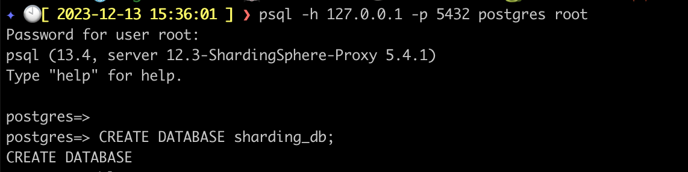
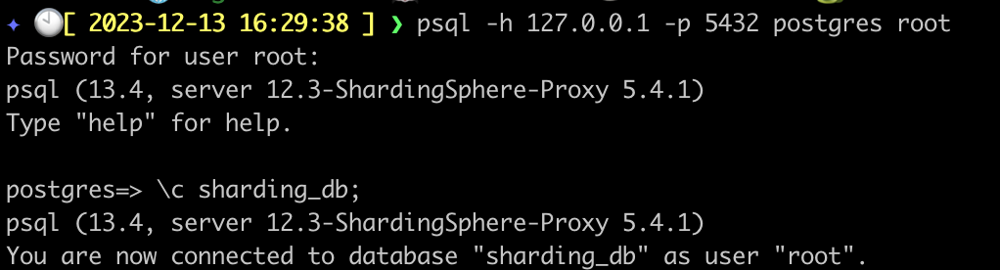
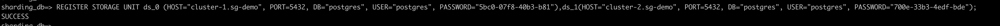


8. Insert test data
```shell
# Insert
sharding_db=> INSERT INTO t_order(order_id, user_id, status) VALUES(1, 1, 'code1'),(2, 2, 'code2'),(3, 3, 'code3'),(4, 4, 'code4');

# Select 
sharding_db=> SELECT * FROM t_order;
```

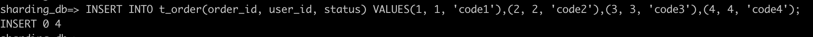
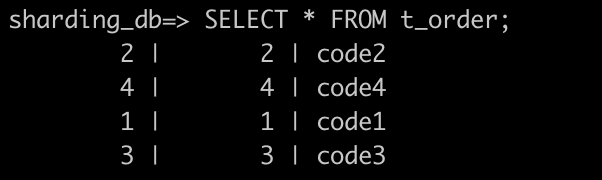

9. Query data with every SGCluster 
```shell
# Access SGCluster via psql
kubectl exec -ti cluster-1-0 -n sg-demo  -c postgres-util -- psql

# Query tables 
\d

# Query data from cluster-1
SELECT * FROM t_order_0;
```

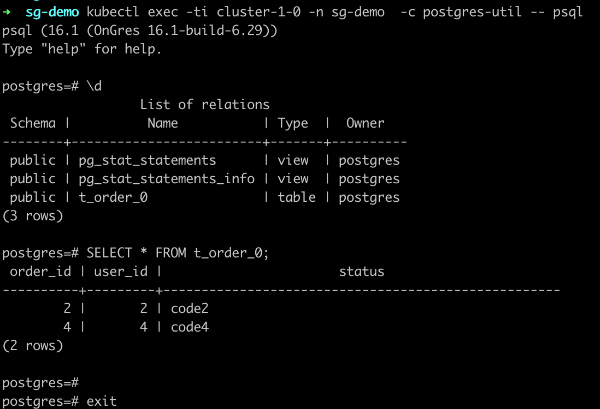

```shell
# Access SGCluster via psql
kubectl exec -ti cluster-2-0 -n sg-demo  -c postgres-util -- psql

# Query tables 
\d

# Query data from cluster-2
SELECT * FROM t_order_1;
```
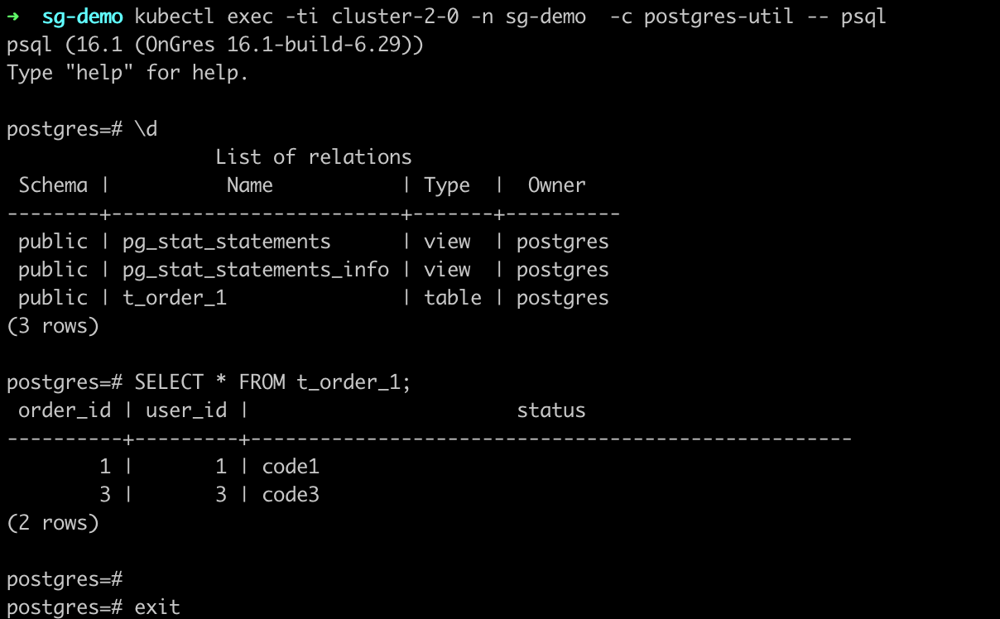

## References

* [https://stackgres.io/doc/latest/quickstart/](https://stackgres.io/doc/latest/quickstart/)
* [https://stackgres.io/doc/latest/install/helm/](https://stackgres.io/doc/latest/install/helm/)
* [https://stackgres.io/doc/latest/administration/cluster/connection/passwords/](https://stackgres.io/doc/latest/administration/cluster/connection/passwords/)
* [https://stackgres.io/doc/latest/administration/cluster/connection/dns/](https://stackgres.io/doc/latest/administration/cluster/connection/dns/)
* [https://shardingsphere.apache.org/oncloud/current/en/user-manual/cn-sn-operator/](https://shardingsphere.apache.org/oncloud/current/en/user-manual/cn-sn-operator/)
* [https://shardingsphere.apache.org/document/current/en/user-manual/shardingsphere-proxy/distsql/usage/sharding-rule/](https://shardingsphere.apache.org/document/current/en/user-manual/shardingsphere-proxy/distsql/usage/sharding-rule/)
